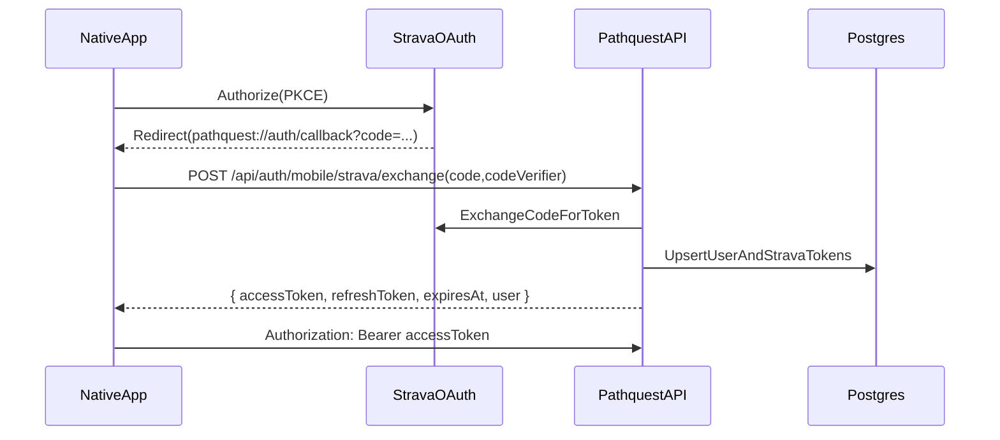

# PathQuest Native Architecture

## Overview
`pathquest-native` is the native mobile client for PathQuest. The short-term goal is **feature parity with the web app** (map + explore + details + profile) while enabling native-only capabilities (accurate geolocation, offline maps, "distance to peak", etc.).

This app is built with **Expo + Expo Router** and uses **Mapbox** via `@rnmapbox/maps`.

**See also:** [DESIGN.md](./DESIGN.md) for detailed wireframes, navigation flows, and UI specifications.

## Goals (v1)
- Replicate the web app UX as closely as makes sense on mobile.
- Support **native Strava OAuth (PKCE)** in-app.
- Establish a shared code layer (no copy/paste) for:
  - API request/response types
  - API client helpers

## Non-goals (v1)
- Background tracking / live summit detection
- Full offline-first database
- Watch app / widgets

## Tech Stack
- **Runtime**: Expo SDK 54 (development builds + EAS)
- **Navigation**: Expo Router
- **Language**: TypeScript
- **Styling**: NativeWind (Tailwind CSS) + gluestack-ui
- **Maps**: `@rnmapbox/maps`
- **Data fetching**: TanStack Query
- **Client state**: Zustand
- **Auth**: Native Strava OAuth (PKCE) + PathQuest session token
- **Storage**:
  - `expo-secure-store` for tokens
  - persistent query cache (optional, later)

## Repository Layout
The native app follows Expo Router conventions with the actual app code in `pathquest/`.

```
pathquest-native/
  ARCHITECTURE.md
  pathquest/                    # Expo app root
    app/                        # Expo Router routes (screens)
      _layout.tsx               # Root layout (providers, theme, navigation chrome)
      (tabs)/                   # Tab-based navigation
        _layout.tsx             # Tab navigator with custom tab bar
        index.tsx               # Home tab (DashboardContent)
        profile.tsx             # Profile tab (ProfileContent)
        explore/                # Explore tab with nested stack routing
          _layout.tsx           # Map + ContentSheet wrapper, renders <Slot />
          index.tsx             # Discovery (peaks/challenges lists)
          peak/
            [peakId].tsx        # Peak detail route
          challenge/
            [challengeId].tsx   # Challenge detail route
          activity/
            [activityId].tsx    # Activity detail route (polyline + weather + elevation profile + summits)
          users/
            [userId].tsx        # User profile route rendered inside Explore bottom sheet (also overlays map with user's peaks)
            [userId]/
              challenges/
                [challengeId].tsx # User challenge progress route rendered inside Explore bottom sheet
      users/
        [userId].tsx            # Full-screen user profile route (deep links / non-Explore entry)
        [userId]/
          challenges/
            [challengeId].tsx   # User challenge progress detail route (deep link)
      auth/
        callback.tsx            # OAuth redirect handler (handles Strava callback)
      settings.tsx              # Settings screen (modal presentation from profile header)
      settings/
        location.tsx            # Location select modal (Mapbox Geocoding autocomplete + map preview)
      modal.tsx
      +html.tsx
      +not-found.tsx
    assets/
      fonts/
      images/
    components/                 # Shared UI components
    constants/
    src/
      components/
        explore/                # Explore tab components
          ChallengeDetail.tsx   # Challenge detail view with retro topo aesthetic (hero card, CircularProgress, MilestoneBadge, CompassRose, recent summits timeline, grouped peaks list)
          ChallengeRow.tsx      # Challenge list item
          DiscoveryContent.tsx  # Discovery mode content (peaks/challenges lists)
          PeakDetail.tsx        # Peak detail orchestrator (data + tab routing)
          PeakDetailHero.tsx    # Peak detail hero card (GPS strip + CTAs + public lands)
          ActivityDetail.tsx    # Activity detail view (hero + elevation profile + achievements + peaks summited + weather)
          ActivityDetailHero.tsx # Activity hero stats card (distance/gain/duration/pace)
          ActivityWeatherCard.tsx # Historical weather at activity start (Open-Meteo Archive API)
          ActivityAchievementsCard.tsx # Activity achievements (multi-peak day, big gain, highest peak PR via ProfileStats) (currently disabled in ActivityDetail)
          ElevationProfile.tsx  # SVG elevation profile with summit markers (best-effort via time_stream)
          ActivitySummitsList.tsx # List of peaks summited using SummitCard component
          PublicLandBadge.tsx   # Public land badge with agency icon
          WeatherSection.tsx    # Always-visible weather (current + forecast + conditions)
          PeakDetailCommunityTab.tsx  # Community tab content (includes PeakPhotosGallery)
          PeakDetailYourLogsTab.tsx   # Your Logs tab content
          PeakPhotosGallery.tsx       # Public photos grid with fullscreen viewer modal
          PeakDetailForecastCard.tsx  # 7-day forecast horizontal scroller (legacy, see WeatherSection)
          PeakDetailDaylightCard.tsx  # Sunrise/sunset + daylight duration (legacy, see WeatherSection)
          PeakDetailConditionsTab.tsx # Conditions tab content (legacy, replaced by WeatherSection)
          PeakRow.tsx           # Peak list item
          index.ts
        home/                   # Home tab components
          DashboardContent.tsx  # Main dashboard wrapper
          FavoriteChallenges.tsx # Favorite challenges with progress
          QuickStats.tsx        # Quick stats bar
          RecentSummits.tsx     # Recent summit list
          index.ts
        map/                    # Map components
          MapView.tsx           # Full-screen Mapbox map wrapper
          PeakMarkers.tsx       # Peak markers layer (GeoJSON + CircleLayer)
          ChallengePeaksOverlay.tsx # Challenge peaks overlay layer (Show on Map)
          UserPeaksOverlay.tsx  # User summited peaks overlay (Explore user profile)
          ActivityPolylineOverlay.tsx # Activity polyline overlay (ShapeSource + LineLayer)
          ActivitySummitMarkers.tsx # Activity summit markers overlay (ShapeSource + CircleLayer)
          index.ts
        navigation/             # Navigation components
          ContentSheet.tsx      # Draggable bottom sheet (3 snap points)
          index.ts
        profile/                # Profile tab components ("Summit Journal" aesthetic)
          ChallengesContent.tsx # "Trophy Case" - challenges with CircularProgress rings
          JournalContent.tsx    # "Field Notes" - journal entries with DateStamp styling
          PeaksContent.tsx      # "Summit Collection" - peaks with ElevationTierBadge
          ProfileContent.tsx    # Profile wrapper with sub-tab nav + useProfileData
          StatsContent.tsx      # "Summit Registry" - hero card with CompassRose, milestones
          index.ts
        settings/               # Settings screen components
          SettingsScreen.tsx    # Full settings page (account, preferences, privacy, delete account)
          LocationSelectScreen.tsx # Location autocomplete with Mapbox Geocoding API + map preview
          index.ts
        ui/                     # Core UI components
          gluestack-provider.tsx # gluestack-ui provider wrapper
          Text.tsx              # Custom Text/Value with baked-in fonts (Fraunces/IBM Plex Mono)
          CardFrame.tsx         # Card container with topo pattern + mountain ridge decorations
          TopoPattern.tsx       # SVG contour line pattern (seed-based, deterministic)
          MountainRidge.tsx     # SVG mountain silhouette decoration
          PrimaryCTA.tsx        # Primary button with spring animations + haptic feedback
          SecondaryCTA.tsx      # Secondary button with spring animations + haptic feedback
          AnimatedPressable.tsx # Base pressable with scale/opacity animations + haptics
          Skeleton.tsx          # Loading skeleton with shimmer animation
                                #   Variants: text, circle, card, stat, rectangle
                                #   Also exports: SkeletonText, SkeletonCard, SkeletonStats
          EmptyState.tsx        # Empty state component (icon + title + description + CTA)
          Toast.tsx             # Toast notification with slide animation + auto-dismiss
          ToastProvider.tsx     # Global toast renderer (uses toastStore)
          index.ts              # Re-exports gluestack + custom components
        shared/                 # Reusable cross-feature components
          TabSwitcher.tsx       # Generic tab switcher (used by Explore/Profile/Challenge/Peak detail)
          SummitCard.tsx        # Reusable summit card with 3-mode layout:
                                #   - Empty state: prominent CTA to add report
                                #   - With content: ratings, tags, notes
                                #   - Profile journal: with peak name header
                                # Features: WMO weather codes, intensity-scaled rating badges
          WeatherDisplay.tsx    # Compact weather row (temp/precip/clouds)
          WeatherBadge.tsx      # Small badge pill (e.g. GOOD/FAIR/POOR)
          GPSStrip.tsx          # GPS strip (distance/bearing/vert)
          UserAvatar.tsx        # Reusable avatar (image/initials/fallback icon)
        modals/                 # Global modal components
          AddReportModal.tsx    # Camera-first trip report modal with:
                                #   - Photo capture + upload with progress
                                #   - Condition tags (multi-select)
                                #   - Difficulty picker (single-select)
                                #   - Experience rating (single-select)
                                #   - Notes (expandable textarea)
                                #   - Custom tags
                                # Uses addReportStore for state management
          ManualSummitModal.tsx # Manual summit entry modal with:
                                #   - Peak search (when opened from Profile)
                                #   - Pre-selected peak display (when opened from Peak Detail)
                                #   - Optional activity linking with nearby search
                                #   - Elevation profile selector (tap to set summit time)
                                #   - Date/time picker with auto-detected timezone (via API)
                                #   - Difficulty + experience rating grids (theme-aware colors)
                                #   - Trip notes
                                #   - Photo uploads (camera + library, same style as AddReportModal)
                                #   - Uses Text/Value components for consistent typography
                                #   - NativeWind classes for styling consistency
                                # Uses manualSummitStore for state management (includes photo state)
          index.ts
      lib/
        api/
          client.ts             # API client with auth injection
          index.ts
        map/
          getMapboxToken.ts     # Mapbox token helper (used for geocoding/place search)
        auth/
          index.ts              # Auth exports
          store.ts              # Zustand auth store
          strava.ts             # Strava PKCE OAuth flow
          tokens.ts             # Token storage (expo-secure-store)
      store/                    # Zustand stores
        index.ts
        mapStore.ts             # Map state (visible peaks, selection, zoom)
        sheetStore.ts           # Bottom sheet snap state
        exploreNavStore.ts      # Explore tab nav history + discovery state persistence
        addReportStore.ts       # Add Report modal state (form data, photos, upload progress)
        manualSummitStore.ts    # Manual summit entry modal state (peak data, open/close)
        toastStore.ts           # Global toast notification state (useToast hook)
      hooks/                    # Custom React hooks
        index.ts
        useHaptics.ts           # Haptic feedback hook (light/medium/heavy/selection/success/warning/error)
        useLocation.ts          # User location tracking
        useMapData.ts           # Map data queries (peaks, challenges)
        usePeakDetailData.ts    # Peak detail queries
        useDashboardData.ts     # Dashboard data queries
        useProfileData.ts       # Profile data queries
        useCompassHeading.ts    # Device compass heading
        useGPSNavigation.ts     # GPS navigation to peak
        useMapNavigation.ts     # Open coordinates in native maps app
        # ... and more
      theme/                    # Theme system
        colors.ts               # Color palette (light/dark)
        index.ts
        ThemeProvider.tsx       # Theme context provider
        typography.ts           # Font scales and styles (Fraunces + IBM Plex Mono)
      utils/                    # Shared utilities (no UI)
        geo.ts                  # Haversine/bearing + unit helpers for geo math + formatLocationString()
        formatting.ts           # Timezone-aware date/time formatting (web parity)
        units.ts                # Unit conversions (C->F, kmh->mph)
        weather.ts              # Weather code + rating helpers
    app.config.ts               # Dynamic Expo config (Mapbox token injection)
    app.json                    # Expo config (static values)
    babel.config.js             # Babel config with NativeWind preset
    global.css                  # Tailwind CSS imports
    metro.config.js             # Metro bundler with NativeWind
    nativewind-env.d.ts         # NativeWind TypeScript declarations
    tailwind.config.js          # Tailwind config with PathQuest theme
    package.json
    tsconfig.json
```

## Shared Code (no copy/paste)
PathQuest uses `@pathquest/shared` (GitHub git dependency) for:
- Shared types (Peak, Challenge, Summit, etc.)
- API endpoint wrappers (pure TypeScript, platform-agnostic)

Both web and native call the same endpoint functions, injecting platform-specific auth headers.

## Peak Detail UI notes

### Layout Structure
Peak Detail uses a redesigned layout that surfaces critical planning information (weather, public lands) more prominently:

```
Hero (with public lands badge)
  ↓
Challenges strip (horizontally scrollable “Included in X challenges”, links to Challenge Detail)
  ↓
Weather Section (always visible)
  ↓
TabSwitcher → [Community | Your Logs]  (2 tabs)
```

### Public Lands Badge
- Displayed in the hero card, below the location string
- Shows the most important public land designation (prioritized by hierarchy: NP > NM > WILD > NF > SP > SF, etc.)
- Agency-specific icons (Landmark for NPS, TreePine for USFS, etc.)
- Uses the peak's accent color (green for unsummited, blue for summited)

### Weather Section (Always Visible)
- **Current Weather Card**: Icon + description, temperature, feels-like, wind with direction arrow, precip probability, humidity
- **Forecast Cards** (horizontal scroll): Each card shows:
  - Day name and date
  - Weather icon
  - High/low temps
  - **Sunrise/sunset times for that specific day**
  - Day rating badge (GOOD/FAIR/POOR)
- **Recent Conditions Tags**: Aggregated from recent public summit reports

### Accent colors
- **Weather**: `colors.secondary` (rust/amber)
- **Community tab**: `colors.primary` (forest green)
- **Your Logs tab**: `colors.summited` (sky blue)

### Hero actions
`PeakDetailHero` renders **Compass + Navigate** side-by-side, and when applicable shows **Add Report** as a full-width primary CTA beneath them.

## Authentication

### Auth Flow (Implemented)


### Token Management
- **Access token**: Short-lived (15 min), stored in `expo-secure-store`
- **Refresh token**: Long-lived (30 days), stored in `expo-secure-store`
- **Auto-refresh**: The auth store automatically refreshes expired tokens before API calls

### Auth Store (`src/lib/auth/store.ts`)
Zustand store managing:
- `isAuthenticated`: boolean
- `isLoading`: boolean (during initialization)
- `user`: StoredUser | null
- `accessToken`: string | null

Actions:
- `initialize()`: Load auth state from secure storage on app startup
- `login(data)`: Save tokens and user after successful OAuth
- `logout()`: Clear all auth data
- `refreshAccessToken()`: Refresh expired access token
- `getValidAccessToken()`: Get a valid token, refreshing if needed

### Strava PKCE Flow (`src/lib/auth/strava.ts`)
- Uses `expo-auth-session` for the OAuth flow
- Generates PKCE code verifier/challenge using `expo-crypto`
- Exchanges code via `POST /api/auth/mobile/strava/exchange`
- Saves tokens to auth store on success

## API Client (`src/lib/api/client.ts`)
Wraps `@pathquest/shared` API client with automatic auth header injection:
- Calls `getValidAccessToken()` before each request
- Automatically refreshes expired tokens

## Maps
- Use `@rnmapbox/maps` for:
  - peak markers
  - challenge overlays
  - activity polylines
  - user location marker (when permission is granted)
- Offline packs (future): define "download region" UX and storage limits.

## Data Fetching & Caching
- Use TanStack Query for all server data.
- Prefer the same endpoint boundaries as the web app (public vs authenticated reads).
- Query client configured in root `_layout.tsx` with 5-minute stale time.

## Environment Variables
Required in Expo config / `.env`:
- `EXPO_PUBLIC_API_URL` - Base URL for `pathquest-api`
- `EXPO_PUBLIC_STRAVA_CLIENT_ID` - Strava OAuth client ID
- `EXPO_PUBLIC_MAPBOX_TOKEN` - Mapbox access token

Note: `STRAVA_CLIENT_SECRET` is **never** shipped in the app - it's only used server-side in `pathquest-api`.

### Build-time secrets (EAS)
Mapbox native SDK dependencies are downloaded from Mapbox's Maven repository during Android builds (and equivalent distribution for iOS). This requires a **Mapbox secret token** (starts with `sk.`) that has the `DOWNLOADS:READ` scope.

- `RNMAPBOX_MAPS_DOWNLOAD_TOKEN` - Mapbox secret token used during EAS builds to authenticate Mapbox SDK downloads (recommended; `RNMapboxMapsDownloadToken` config option is deprecated).

Recommended setup:
- Store it as an EAS project secret: `eas secret:create --scope project --name RNMAPBOX_MAPS_DOWNLOAD_TOKEN --value <sk...>`
- Do **not** commit it to the repo.

## Styling Architecture

### NativeWind + Tailwind CSS
The app uses **NativeWind v4** to enable Tailwind CSS styling in React Native. This matches the web app's styling approach.

**Configuration files:**
- `tailwind.config.js` - Tailwind configuration with PathQuest color palette
- `babel.config.js` - Babel preset for NativeWind JSX transform
- `metro.config.js` - Metro bundler integration with NativeWind
- `global.css` - Tailwind base/components/utilities imports
- `nativewind-env.d.ts` - TypeScript declarations for className prop

**Usage:**
```tsx
// Using Tailwind classes directly
<View className="bg-card/92 rounded-xl p-4 border border-border">
  <Text className="text-foreground font-display text-xl">Peak Name</Text>
</View>
```

### gluestack-ui
For pre-built accessible components, we use **gluestack-ui** (similar to shadcn/ui for web):
- Pre-built components: Box, VStack, HStack, Pressable, Spinner, etc.
- Accessible by default
- Themeable with NativeWind classes

**Provider setup:** `GluestackProvider` wraps the app in root `_layout.tsx`

### Custom Text Components
Since React Native doesn't support font inheritance, we created custom components with fonts baked in:

```tsx
import { Text, Value } from '@/src/components/ui';

// Text - uses Fraunces (serif/display font) - for labels, headings, body, elevations, aggregations
<Text className="text-foreground text-lg font-semibold">Peak Name</Text>
<Text className="text-muted-foreground text-sm">14,259 ft</Text>

// Value - uses IBM Plex Mono - ONLY for live navigation data (compass bearing, GPS coordinates)
<Value className="text-muted-foreground text-sm">N 45° 32.1'</Value>
```

**Important:** In profile/stats contexts, use `Text` even for numbers like elevations and aggregations. Reserve `Value` (mono font) only for real-time navigation data like compass bearings, GPS coordinates, and live distance readings.

This avoids needing to add `font-display` or `font-mono` to every Text element.

### Color Palette
The Tailwind config includes the exact PathQuest "retro topographic" palette from `globals.css`:
- `bg-background` / `bg-card` - Warm brown surfaces
- `text-foreground` / `text-muted-foreground` - Text colors
- `bg-primary` - Forest green CTAs
- `bg-summited` - Sky blue for summited indicators
- `border-border` - Semi-transparent borders

## UI Architecture

The native app uses a unified layout pattern that mirrors the web app:
- **Map is always visible** as the background layer
- **All tab content** lives inside a draggable ContentSheet overlay
- **Tab bar** is fixed at the bottom, independent of the sheet

### Theme System (`src/theme/`)
- **colors.ts**: EXACT match to web app's globals.css oklch colors
  - **Follows system light/dark** by default (can be overridden via `forcedColorScheme`)
  - Dark warm brown (hue 80) for backgrounds/surfaces
  - Semi-transparent card color for glass effect
  - Forest green (hue 140) for primary/CTA
  - Sky blue (hue 220) for summited indicators
  - `contourInk` / `contourInkSubtle` for topographic linework textures
  - Semantic stat colors: `statForest`, `statTrail`, `statGold`, `statMuted`
- **typography.ts**: Font scales matching web
  - **Fraunces** for display/headings (loaded via @expo-google-fonts/fraunces)
  - **IBM Plex Mono** for body/data text (loaded via @expo-google-fonts/ibm-plex-mono)
  - Tailwind classes: `font-display`, `font-mono`
- **index.ts**: ThemeProvider + hooks (useTheme, useColors)

### Retro Topo UI Primitives (`src/components/ui/`)
- `TopoPattern`: deterministic, seed-based SVG contour line background
- `MountainRidge`: SVG ridge silhouette decoration
- `CardFrame`: consistent card surface (border + inner highlight + shadow) with optional topo/ridge
- `PrimaryCTA` / `SecondaryCTA`: pressable CTA components with strong affordances (bevel + pressed state)

### Layout (`app/(tabs)/_layout.tsx`)
Tab-specific layouts:
- **Home tab**: Full-screen dashboard (no map, data-centric)
- **Explore tab**: Map background + ContentSheet + floating cards
- **You tab**: Full-screen profile (no map by default)
- **Tab bar** fixed at bottom with Home/Explore/You tabs
- Tab switching is state-based (no route navigation)

Only the Explore tab shows the map. Home and You tabs render as full-screen content with the `bg-background` color, respecting safe area insets.

### Selection Flow (Current)
Explore uses a routing-style selection flow tuned for “browse-first”:
1. **Marker tap (sheet collapsed)** → **Floating mode** (`selectionMode='floating'`): a small card appears over the map.
2. **Marker tap (sheet not collapsed)** → **Detail mode** (`selectionMode='detail'`) and the sheet auto-expands.
3. **List row tap (DiscoveryContent)** → **Detail mode** and the sheet auto-expands (skips floating card).
4. **Omnibar result tap** → **Detail mode** and the sheet auto-expands (skips floating card).

Floating cards are intentionally **collapsed-only**: if the user drags the sheet up while in floating mode, the floating selection is dismissed.

### Bottom Sheet (`ContentSheet`)
Uses `@gorhom/bottom-sheet` with 3 snap points:
- **Collapsed** (~80px): Just handle visible, map fully visible
- **Halfway** (~45%): Default, map partially visible
- **Expanded** (~90%): Full content view

The sheet index is controlled via `sheetStore.snapIndex` to enable programmatic expansion when entering detail.

Note: Scrollable content inside the sheet should use Gorhom's scrollables (`BottomSheetScrollView`, etc.) so vertical swipes scroll content instead of dragging the sheet.

### Dismiss-to-discovery navigation
Some X-button “dismiss” actions intentionally route to `/explore` (instead of `/explore/index`) to match Expo Router runtime resolution. In a few places we use `router.navigate("/explore" as any)` as a pragmatic workaround for overly-strict typed-route unions.

To avoid the sheet sliding into reserved overlay space (e.g. the Explore omnibar gap), over-drag is disabled so the expanded snap point behaves as a hard stop.

### Map (`src/components/map/`)
- **MapView**: Full-screen Mapbox wrapper with outdoor style, 3D terrain, location puck
  - Auto-requests location permissions on mount
  - Phase 2: auto-centers on the user once on initial map load (best-effort, falls back to default center)
  - `centerOnUser()` method to fly to user location
- **PeakMarkers**: GeoJSON ShapeSource + CircleLayer for peak markers
  - Different colors for summited (sky blue) vs unsummited (green)
  - Selection ring for highlighted peak
- **CenterOnMeButton**: FAB with pulse animation to recenter on user
- **LineToTarget**: Dashed line from user to selected peak (Phase 2: needs user location)

### Floating Cards (`src/components/explore/`)
- **FloatingPeakCard**: Shows peak info, GPS strip placeholder, action buttons
  - Entry animation (consistent spring config: damping 20, stiffness 200)
  - Swipe-down to dismiss with snap-back spring
  - Actions: Details, Compass, Navigate (via `useMapNavigation` hook)
- **FloatingChallengeCard**: Shows challenge progress, nearest unsummited peak
  - Same animation and gesture handling as peak card (consistent spring config)
  - Actions: Details, Navigate (via `useMapNavigation` hook)

### Explore Sheet (`src/components/explore/DiscoveryContent.tsx`)
- Phase 2: Uses CardFrame-based rows for the new "retro topo" design language.
- Search functionality moved to top-of-map omnibar overlay (see ExploreOmnibar below).
- **Challenges browsing**: Challenges list supports two modes:
  - **In view**: Uses `mapStore.visibleChallenges` (viewport-driven)
  - **All**: Uses `useAllChallenges()` (calls `/challenges/search` with no bounds), independent of map zoom/viewport, with a “Load more” CTA (client-side pagination)
  - Challenge rows show a **progress bar** plus badges for **Accepted** (favorited) and **Completed**.

### Explore Omnibar (`src/components/explore/ExploreOmnibar.tsx`)
- Top-of-map search overlay (similar to web app).
- Debounced search (250ms) using shared `searchPeaks` and `searchChallenges` endpoints.
- Dropdown results show up to 6 peaks + 6 challenges, prioritized with challenges first.
- Selecting a result triggers `onPeakPress`/`onChallengePress` callbacks (wired to mapStore selection + map flyTo).

### State Management (`src/store/`)
- **mapStore**: Visible peaks/challenges, selection state, zoom level, bounds
  - `selectionMode`: `'none' | 'floating' | 'detail'`
  - `selectPeak(id)` / `selectChallenge(id)`: Select and show floating card (collapsed-only)
  - `openDetail()`: Transition from floating card to full detail (also expands the sheet)
  - `clearSelection()`: Reset selection state
  - `challengeOverlayPeaks`: Peak overlay for challenge detail views (shows challenge peaks with user's summits highlighted in blue via `is_summited`).
  - `userOverlayPeaks`: Peak overlay for user profile views (shows user's summited peaks).
  - Overlay priority: when `challengeOverlayPeaks` is set, it takes precedence over `userOverlayPeaks`.
  - **Auto-show behavior**: Overlays are automatically set when entering challenge detail, user profile, or user challenge progress pages. The map fits to bounds ONCE on initial load (not on sheet snap changes).
  - **Auto-zoom for peaks**: When entering peak detail from discovery (no overlay), the map auto-zooms to the peak (zoom level 13) ONCE on initial load.
  - **Overlay persistence**: Overlays persist when navigating to nested detail views (e.g., peak detail from challenge). They are cleared when:
    1. Pressing the X button (dismiss to discovery)
    2. Pressing the back button from the overlay source (challenge/profile)
    3. Navigating directly to discovery view (which auto-clears all overlays)
  - **Recenter button**: A crosshair FAB appears when an overlay is active OR when viewing a single peak from discovery. It fits the map to overlay bounds or flies to the selected peak.
  - Share UX: only the current user's own progress shows a share CTA; viewing another user's progress instead offers "View my progress".
  - User challenge progress UI: the Progress tab mirrors personal Challenge Detail with milestone-style badges and a full "All peaks" list using `PeakRow` (summited peaks show the blue summit medal/accent).
- **sheetStore**: Bottom sheet snap index
- **exploreNavStore**: Discovery state persistence (navigation handled by Expo Router)
  - `discoveryState`: Persisted discovery state (active tab, challenge filter)
  - `setDiscoveryTab(tab)`: Set active discovery tab ('peaks' | 'challenges')
  - `setChallengeFilter(filter)`: Set challenge filter ('inView' | 'all')
  - Note: Navigation history is now handled by Expo Router's native stack

### Hooks (`src/hooks/`)
- **useLocation**: Location permission management
- **useMapPeaks/useMapChallenges**: Fetch peaks/challenges for map bounds
- **useAllChallenges**: Fetch all challenges (progress-aware via `/challenges/search`) for Explore "All challenges" mode
- **useChallengeDetails**: Fetch `/challenges/:id/details` (public challenge + peak list)
- **useActivityDetails**: Fetch `/activities/:activityId` (owner-only activity + summits)
- **useUserChallengeProgress**: Fetch `/users/:userId/challenges/:challengeId` (auth-gated per-user completion + summit dates)
  - Note: route components that consume this hook must keep React hooks (e.g., `useMemo`, `useEffect`) unconditional across loading/data renders to avoid hook-order warnings in dev.
- **useNextPeakSuggestion**: Fetch `/challenges/:id/next-peak` (auth-gated next peak suggestion, uses lat/lng when available)
- **useDashboardData**: Combined dashboard data hook
- **useSuggestedPeak**: Fetch suggested next peak with weather
- **useLocationPolling**: Poll last-known device location (Mapbox) on an interval
- **useGPSNavigation**: Compute distance/bearing/vert-to-target from polled location + target coords
- **useProfileData**: Combined profile data hook (stats, peaks, journal, challenges)
  - `useUserProfile`: Fetch user profile with stats and accepted challenges
  - `useUserPeaks`: Fetch user's summited peaks with summit counts
  - `useUserJournal`: Fetch user's summit journal entries (summits with notes)
- **usePeakDetails/usePeakWeather/usePeakForecast/usePeakActivity**: Peak detail data hooks
- **useCompassHeading**: Magnetometer heading for compass navigation

## Next Steps

See [DESIGN.md](./DESIGN.md) for detailed implementation phases and wireframes.

### Completed
1. ✅ Create the Expo app scaffold (Expo Router)
2. ✅ Add PKCE OAuth flow + callback route
3. ✅ Add API client with auth injection
4. ✅ Add Mapbox map view + marker rendering
5. ✅ Implement peak/challenge detail screens (basic)
6. ✅ Add profile screens with sub-tabs (basic)
7. ✅ **Phase 1: Core Navigation + Explore**
   - Renamed Profile tab to "You"
   - Added location puck to map with permission request
   - Added CenterOnMeButton FAB
   - Added selectionMode to mapStore (none/floating/detail)
   - Created FloatingPeakCard with animations + swipe-to-dismiss
   - Created FloatingChallengeCard with progress bar
   - Wired floating cards into tab layout
   - Created LineToTarget component (awaits user location in Phase 2)
8. ✅ **Dashboard Refresh**
   - Refactored QuickStats to show 3 lifetime metrics (peaks, elevation, challenge)
   - Added `/dashboard/suggested-peak` API endpoint (closest unclimbed peak with weather)
   - Created SuggestedPeakCard hero component
   - Created TripReportCTA for unreported summits
   - Updated DashboardContent to new layout
9. ✅ **Phase 2: Peak Detail + GPS**
   - Full Peak Detail with hero card, GPS strip, 3 tabs
   - Conditions tab with weather, forecast, daylight card
   - Community tab with cursor-paginated public summits
   - Your Logs tab with user ascents and "Add Report" CTA
   - GPS navigation hooks (useGPSNavigation, useLocationPolling)
   - Peak data hooks (usePeakDetails, usePeakWeather, usePeakForecast, etc.)
10. ✅ **Phase 2.5: Compass View**
    - Full-screen compass with magnetometer
    - Real-time bearing/distance updates
    - Open in Maps integration
11. ✅ **Phase 3: You Tab Data Fetching**
    - Created `useProfileData` hook for profile data fetching
    - Stats tab displays real user stats (peaks, elevation, challenges, etc.)
    - Peaks tab displays summited peaks with summit counts
    - Journal tab displays summit entries with notes
    - Challenges tab displays accepted challenges with progress
12. ✅ **Phase 2.9: Challenge Detail + Show on Map**
   - Challenge detail now renders real Progress + Peaks tabs (Peaks public, Progress auth-gated with login prompt)
   - Favorite toggle wired to `/challenges/favorite` endpoints with query invalidation
   - “Show on Map” sets a challenge peaks overlay layer and fits the map to the challenge bounds (collapses to floating card)

### ✅ Phase 2: Peak Detail + GPS (COMPLETED)
- Hero card with GPS strip (distance/bearing/vert) using last-known device location (best-effort)
  - Uses `CardFrame` hero styling with **full topo texture** (`topo="full"`) and a subtle accent wash
  - Visual state: **green** for unsummited peaks, **blue** (`colors.summited`) for summited peaks
  - Vert calculation uses peak elevation (meters) minus device altitude (meters), converted to feet
- Conditions tab (current weather)
  - Wind now renders as an arrow indicator (direction wind is blowing toward) instead of raw degrees
  - Current precip probability shown when available (best-effort via Open-Meteo hourly precipitation_probability)
  - Forecast cards include wind speed + direction arrow
- Community tab (cursor-paginated public summits)
- Your Logs tab (auth-gated; displays your ascents)

### ✅ Phase 2.5: Compass View (COMPLETED)
- Dedicated Compass screen: `app/compass/[peakId].tsx`
- Uses `expo-sensors` (Magnetometer) for device heading + GPS bearing to peak to rotate arrow
- Linked from Explore floating peak card and Peak Detail

### ✅ Phase 3: You Tab Enhancement (COMPLETED)
- ✅ You tab list mode with all sub-tabs (Stats, Peaks, Journal, Challenges)
- ✅ Profile data fetching via `useProfileData` hook
- ✅ Journal entries display (summits with notes)
- ✅ Fixed elevation display (peaks use `elevation` field, not `altitude`)
- ✅ Fixed total peaks count (uses `stats.totalPeaks` from profile, not pagination-limited array length)
- ✅ Removed mono font from profile elevations/aggregations (reserved for live nav data only)
- ⏳ You tab map mode toggle (not yet implemented)

### ✅ Phase 4: Actions + Modals (COMPLETED)
- ✅ Add Report modal (camera-first photo capture, condition tags, difficulty/experience ratings, notes, custom tags)
- ✅ Manual Summit entry (peak search, activity linking, date/time picker with timezone, difficulty/experience ratings, trip notes)
- ⏳ Login prompt for auth-gated actions (pending - needed for better UX when users try to favorite/add report without auth)
- ✅ Settings screen (account info, units preference, privacy toggles, sign out, delete account)

### Phase 5: Polish + Offline
- Offline queue for reports
- TanStack Query persistence
- Onboarding flow
- Push notification setup
