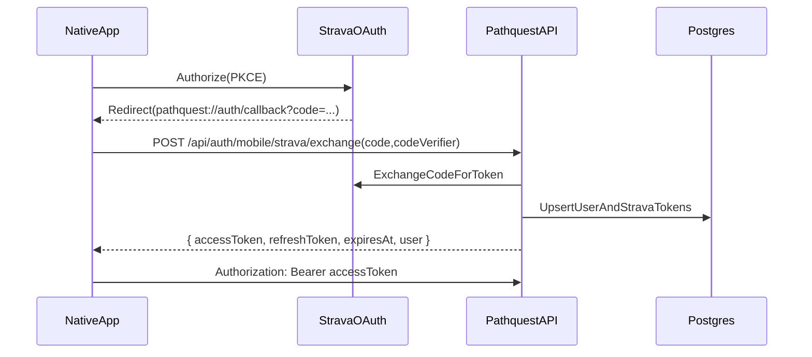

# PathQuest Native Architecture

## Overview
`pathquest-native` is the native mobile client for PathQuest. The short-term goal is **feature parity with the web app** (map + explore + details + profile) while enabling native-only capabilities (accurate geolocation, offline maps, "distance to peak", etc.).

This app is built with **Expo + Expo Router** and uses **Mapbox** via `@rnmapbox/maps`.

**See also:** [DESIGN.md](./DESIGN.md) for detailed wireframes, navigation flows, and UI specifications.

## Goals (v1)
- Replicate the web app UX as closely as makes sense on mobile.
- Support **native Strava OAuth (PKCE)** in-app.
- Establish a shared code layer (no copy/paste) for:
  - API request/response types
  - API client helpers

## Non-goals (v1)
- Background tracking / live summit detection
- Full offline-first database
- Watch app / widgets

## Tech Stack
- **Runtime**: Expo SDK 54 (development builds + EAS)
- **Navigation**: Expo Router
- **Language**: TypeScript
- **Styling**: NativeWind (Tailwind CSS) + gluestack-ui
- **Maps**: `@rnmapbox/maps`
- **Data fetching**: TanStack Query
- **Client state**: Zustand
- **Auth**: Native Strava OAuth (PKCE) + PathQuest session token
- **Storage**:
  - `expo-secure-store` for tokens
  - persistent query cache (optional, later)

## Repository Layout
The native app follows Expo Router conventions with the actual app code in `pathquest/`.

```
pathquest-native/
  ARCHITECTURE.md
  pathquest/                    # Expo app root
    app/                        # Expo Router routes (screens)
      _layout.tsx               # Root layout (providers, theme, navigation chrome)
      (tabs)/                   # Tab-based navigation
        _layout.tsx             # Unified layout with map + all tab content
        index.tsx               # Route placeholder (content in _layout)
      auth/
        callback.tsx            # OAuth redirect handler (handles Strava callback)
      modal.tsx
      +html.tsx
      +not-found.tsx
    assets/
      fonts/
      images/
    components/                 # Shared UI components
    constants/
    src/
      components/
        explore/                # Explore tab components
          ChallengeDetail.tsx   # Challenge detail view with sub-tabs
          ChallengeRow.tsx      # Challenge list item
          DiscoveryContent.tsx  # Discovery mode content (peaks/challenges lists)
          PeakDetail.tsx        # Peak detail view with sub-tabs
          PeakRow.tsx           # Peak list item
          index.ts
        home/                   # Home tab components
          DashboardContent.tsx  # Main dashboard wrapper
          FavoriteChallenges.tsx # Favorite challenges with progress
          QuickStats.tsx        # Quick stats bar
          RecentSummits.tsx     # Recent summit list
          index.ts
        map/                    # Map components
          MapView.tsx           # Full-screen Mapbox map wrapper
          PeakMarkers.tsx       # Peak markers layer (GeoJSON + CircleLayer)
          index.ts
        navigation/             # Navigation components
          ContentSheet.tsx      # Draggable bottom sheet (3 snap points)
          index.ts
        profile/                # Profile tab components
          ChallengesContent.tsx # Challenges sub-tab
          JournalContent.tsx    # Journal sub-tab
          PeaksContent.tsx      # Peaks list sub-tab
          ProfileContent.tsx    # Profile wrapper with sub-tab nav
          StatsContent.tsx      # Stats sub-tab
          index.ts
        ui/                     # Core UI components
          gluestack-provider.tsx # gluestack-ui provider wrapper
          Text.tsx              # Custom Text/Value with baked-in fonts
          index.ts              # Re-exports gluestack + custom components
      lib/
        api/
          client.ts             # API client with auth injection
          index.ts
        auth/
          index.ts              # Auth exports
          store.ts              # Zustand auth store
          strava.ts             # Strava PKCE OAuth flow
          tokens.ts             # Token storage (expo-secure-store)
      store/                    # Zustand stores
        index.ts
        mapStore.ts             # Map state (visible peaks, selection, zoom)
        sheetStore.ts           # Bottom sheet snap state
      theme/                    # Theme system
        colors.ts               # Color palette (light/dark)
        index.ts
        ThemeProvider.tsx       # Theme context provider
        typography.ts           # Font scales and styles
    app.config.ts               # Dynamic Expo config (Mapbox token injection)
    app.json                    # Expo config (static values)
    babel.config.js             # Babel config with NativeWind preset
    global.css                  # Tailwind CSS imports
    metro.config.js             # Metro bundler with NativeWind
    nativewind-env.d.ts         # NativeWind TypeScript declarations
    tailwind.config.js          # Tailwind config with PathQuest theme
    package.json
    tsconfig.json
```

## Shared Code (no copy/paste)
PathQuest uses `@pathquest/shared` (GitHub git dependency) for:
- Shared types (Peak, Challenge, Summit, etc.)
- API endpoint wrappers (pure TypeScript, platform-agnostic)

Both web and native call the same endpoint functions, injecting platform-specific auth headers.

## Authentication

### Auth Flow (Implemented)


### Token Management
- **Access token**: Short-lived (15 min), stored in `expo-secure-store`
- **Refresh token**: Long-lived (30 days), stored in `expo-secure-store`
- **Auto-refresh**: The auth store automatically refreshes expired tokens before API calls

### Auth Store (`src/lib/auth/store.ts`)
Zustand store managing:
- `isAuthenticated`: boolean
- `isLoading`: boolean (during initialization)
- `user`: StoredUser | null
- `accessToken`: string | null

Actions:
- `initialize()`: Load auth state from secure storage on app startup
- `login(data)`: Save tokens and user after successful OAuth
- `logout()`: Clear all auth data
- `refreshAccessToken()`: Refresh expired access token
- `getValidAccessToken()`: Get a valid token, refreshing if needed

### Strava PKCE Flow (`src/lib/auth/strava.ts`)
- Uses `expo-auth-session` for the OAuth flow
- Generates PKCE code verifier/challenge using `expo-crypto`
- Exchanges code via `POST /api/auth/mobile/strava/exchange`
- Saves tokens to auth store on success

## API Client (`src/lib/api/client.ts`)
Wraps `@pathquest/shared` API client with automatic auth header injection:
- Calls `getValidAccessToken()` before each request
- Automatically refreshes expired tokens

## Maps
- Use `@rnmapbox/maps` for:
  - peak markers
  - challenge overlays
  - activity polylines
  - user location marker (when permission is granted)
- Offline packs (future): define "download region" UX and storage limits.

## Data Fetching & Caching
- Use TanStack Query for all server data.
- Prefer the same endpoint boundaries as the web app (public vs authenticated reads).
- Query client configured in root `_layout.tsx` with 5-minute stale time.

## Environment Variables
Required in Expo config / `.env`:
- `EXPO_PUBLIC_API_URL` - Base URL for `pathquest-api`
- `EXPO_PUBLIC_STRAVA_CLIENT_ID` - Strava OAuth client ID
- `EXPO_PUBLIC_MAPBOX_TOKEN` - Mapbox access token

Note: `STRAVA_CLIENT_SECRET` is **never** shipped in the app - it's only used server-side in `pathquest-api`.

### Build-time secrets (EAS)
Mapbox native SDK dependencies are downloaded from Mapbox's Maven repository during Android builds (and equivalent distribution for iOS). This requires a **Mapbox secret token** (starts with `sk.`) that has the `DOWNLOADS:READ` scope.

- `RNMAPBOX_MAPS_DOWNLOAD_TOKEN` - Mapbox secret token used during EAS builds to authenticate Mapbox SDK downloads (recommended; `RNMapboxMapsDownloadToken` config option is deprecated).

Recommended setup:
- Store it as an EAS project secret: `eas secret:create --scope project --name RNMAPBOX_MAPS_DOWNLOAD_TOKEN --value <sk...>`
- Do **not** commit it to the repo.

## Styling Architecture

### NativeWind + Tailwind CSS
The app uses **NativeWind v4** to enable Tailwind CSS styling in React Native. This matches the web app's styling approach.

**Configuration files:**
- `tailwind.config.js` - Tailwind configuration with PathQuest color palette
- `babel.config.js` - Babel preset for NativeWind JSX transform
- `metro.config.js` - Metro bundler integration with NativeWind
- `global.css` - Tailwind base/components/utilities imports
- `nativewind-env.d.ts` - TypeScript declarations for className prop

**Usage:**
```tsx
// Using Tailwind classes directly
<View className="bg-card/92 rounded-xl p-4 border border-border">
  <Text className="text-foreground font-display text-xl">Peak Name</Text>
</View>
```

### gluestack-ui
For pre-built accessible components, we use **gluestack-ui** (similar to shadcn/ui for web):
- Pre-built components: Box, VStack, HStack, Pressable, Spinner, etc.
- Accessible by default
- Themeable with NativeWind classes

**Provider setup:** `GluestackProvider` wraps the app in root `_layout.tsx`

### Custom Text Components
Since React Native doesn't support font inheritance, we created custom components with fonts baked in:

```tsx
import { Text, Value } from '@/src/components/ui';

// Text - uses Fraunces (serif/display font) - for labels, headings, body
<Text className="text-foreground text-lg font-semibold">Peak Name</Text>

// Value - uses IBM Plex Mono - for numbers, stats, data
<Value className="text-muted-foreground text-sm">14,259 ft</Value>
```

This avoids needing to add `font-display` or `font-mono` to every Text element.

### Color Palette
The Tailwind config includes the exact PathQuest "retro topographic" palette from `globals.css`:
- `bg-background` / `bg-card` - Warm brown surfaces
- `text-foreground` / `text-muted-foreground` - Text colors
- `bg-primary` - Forest green CTAs
- `bg-summited` - Sky blue for summited indicators
- `border-border` - Semi-transparent borders

## UI Architecture

The native app uses a unified layout pattern that mirrors the web app:
- **Map is always visible** as the background layer
- **All tab content** lives inside a draggable ContentSheet overlay
- **Tab bar** is fixed at the bottom, independent of the sheet

### Theme System (`src/theme/`)
- **colors.ts**: EXACT match to web app's globals.css oklch colors
  - **Dark mode forced by default** (like the web app)
  - Dark warm brown (hue 80) for backgrounds/surfaces
  - Semi-transparent card color for glass effect
  - Forest green (hue 140) for primary/CTA
  - Sky blue (hue 220) for summited indicators
- **typography.ts**: Font scales matching web
  - **Fraunces** for display/headings (loaded via @expo-google-fonts/fraunces)
  - **IBM Plex Mono** for body/data text (loaded via @expo-google-fonts/ibm-plex-mono)
  - Tailwind classes: `font-display`, `font-mono`
- **index.ts**: ThemeProvider + hooks (useTheme, useColors)

### Layout (`app/(tabs)/_layout.tsx`)
Unified layout managing:
- **MapView** as full-screen background (always visible)
- **ContentSheet** draggable overlay containing all tab content
- **Tab bar** fixed at bottom with Home/Explore/Profile tabs
- Tab switching is state-based (no route navigation)

### Bottom Sheet (`ContentSheet`)
Uses `@gorhom/bottom-sheet` with 3 snap points:
- **Collapsed** (~80px): Just handle visible, map fully visible
- **Halfway** (~45%): Default, map partially visible
- **Expanded** (~90%): Full content view

### Map (`src/components/map/`)
- **MapView**: Full-screen Mapbox wrapper with outdoor style, 3D terrain, location puck
- **PeakMarkers**: GeoJSON ShapeSource + CircleLayer for peak markers
  - Different colors for summited (sky blue) vs unsummited (green)
  - Selection ring for highlighted peak

### State Management (`src/store/`)
- **mapStore**: Visible peaks/challenges, selection state, zoom level, bounds
- **sheetStore**: Bottom sheet snap index

## Next Steps

See [DESIGN.md](./DESIGN.md) for detailed implementation phases and wireframes.

### Completed
1. ✅ Create the Expo app scaffold (Expo Router)
2. ✅ Add PKCE OAuth flow + callback route
3. ✅ Add API client with auth injection
4. ✅ Add Mapbox map view + marker rendering
5. ✅ Implement peak/challenge detail screens (basic)
6. ✅ Add profile screens with sub-tabs (basic)

### Phase 1: Core Navigation + Explore
- Refactor to 3-tab navigation (Home/Explore/You)
- Explore tab with map + discovery sheet
- Peak/Challenge floating cards
- "Show on Map" flow

### Phase 2: Peak Detail + GPS
- Collapsible hero with GPS strip (distance/bearing/vert)
- Conditions, Community, Your Logs sub-tabs
- Compass View
- Location permission flow

### Phase 3: Home + You Tabs
- Home dashboard (hero card, stats, challenges, activity feed)
- You tab list mode with all sub-tabs
- You tab map mode toggle

### Phase 4: Actions + Modals
- Add Report modal (camera-first)
- Manual Summit entry
- Login prompt for auth-gated actions
- Settings screen

### Phase 5: Polish + Offline
- Offline queue for reports
- TanStack Query persistence
- Onboarding flow
- Push notification setup
