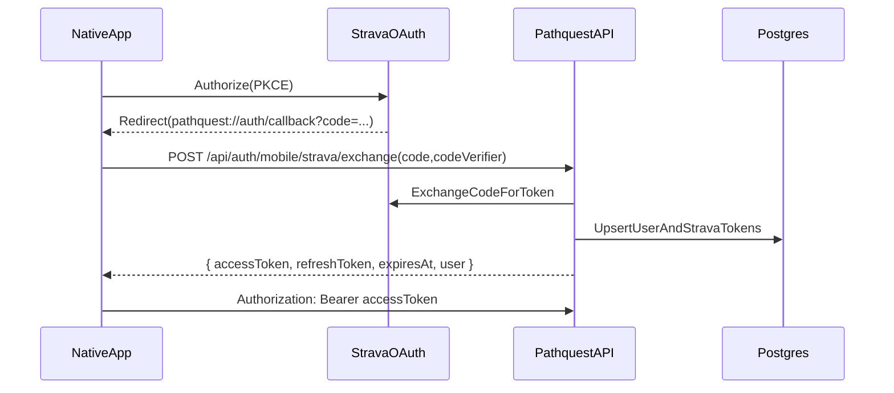

# PathQuest Native Architecture

## Overview
`pathquest-native` is the native mobile client for PathQuest. The short-term goal is **feature parity with the web app** (map + explore + details + profile) while enabling native-only capabilities (accurate geolocation, offline maps, "distance to peak", etc.).

This app is built with **Expo + Expo Router** and uses **Mapbox** via `@rnmapbox/maps`.

## Goals (v1)
- Replicate the web app UX as closely as makes sense on mobile.
- Support **native Strava OAuth (PKCE)** in-app.
- Establish a shared code layer (no copy/paste) for:
  - API request/response types
  - API client helpers

## Non-goals (v1)
- Background tracking / live summit detection
- Full offline-first database
- Watch app / widgets

## Tech Stack
- **Runtime**: Expo SDK 54 (development builds + EAS)
- **Navigation**: Expo Router
- **Language**: TypeScript
- **Maps**: `@rnmapbox/maps`
- **Data fetching**: TanStack Query
- **Client state**: Zustand
- **Auth**: Native Strava OAuth (PKCE) + PathQuest session token
- **Storage**:
  - `expo-secure-store` for tokens
  - persistent query cache (optional, later)

## Repository Layout
The native app follows Expo Router conventions with the actual app code in `pathquest/`.

```
pathquest-native/
  ARCHITECTURE.md
  pathquest/                    # Expo app root
    app/                        # Expo Router routes (screens)
      _layout.tsx               # Root layout (providers, theme, navigation chrome)
      (tabs)/                   # Tab-based navigation
        _layout.tsx
        index.tsx               # Home / map screen
        two.tsx
      auth/
        callback.tsx            # OAuth redirect handler
      modal.tsx
      +html.tsx
      +not-found.tsx
    assets/
      fonts/
      images/
    components/                 # Shared UI components
    constants/
    src/
      lib/
        api/
          client.ts             # API client with auth injection
          index.ts
        auth/
          index.ts              # Auth exports
          store.ts              # Zustand auth store
          strava.ts             # Strava PKCE OAuth flow
          tokens.ts             # Token storage (expo-secure-store)
    app.json                    # Expo config
    package.json
    tsconfig.json
```

## Shared Code (no copy/paste)
PathQuest uses `@pathquest/shared` (GitHub git dependency) for:
- Shared types (Peak, Challenge, Summit, etc.)
- API endpoint wrappers (pure TypeScript, platform-agnostic)

Both web and native call the same endpoint functions, injecting platform-specific auth headers.

## Authentication

### Auth Flow (Implemented)


### Token Management
- **Access token**: Short-lived (15 min), stored in `expo-secure-store`
- **Refresh token**: Long-lived (30 days), stored in `expo-secure-store`
- **Auto-refresh**: The auth store automatically refreshes expired tokens before API calls

### Auth Store (`src/lib/auth/store.ts`)
Zustand store managing:
- `isAuthenticated`: boolean
- `isLoading`: boolean (during initialization)
- `user`: StoredUser | null
- `accessToken`: string | null

Actions:
- `initialize()`: Load auth state from secure storage on app startup
- `login(data)`: Save tokens and user after successful OAuth
- `logout()`: Clear all auth data
- `refreshAccessToken()`: Refresh expired access token
- `getValidAccessToken()`: Get a valid token, refreshing if needed

### Strava PKCE Flow (`src/lib/auth/strava.ts`)
- Uses `expo-auth-session` for the OAuth flow
- Generates PKCE code verifier/challenge using `expo-crypto`
- Exchanges code via `POST /api/auth/mobile/strava/exchange`
- Saves tokens to auth store on success

## API Client (`src/lib/api/client.ts`)
Wraps `@pathquest/shared` API client with automatic auth header injection:
- Calls `getValidAccessToken()` before each request
- Automatically refreshes expired tokens

## Maps
- Use `@rnmapbox/maps` for:
  - peak markers
  - challenge overlays
  - activity polylines
  - user location marker (when permission is granted)
- Offline packs (future): define "download region" UX and storage limits.

## Data Fetching & Caching
- Use TanStack Query for all server data.
- Prefer the same endpoint boundaries as the web app (public vs authenticated reads).
- Query client configured in root `_layout.tsx` with 5-minute stale time.

## Environment Variables
Required in Expo config / `.env`:
- `EXPO_PUBLIC_API_URL` - Base URL for `pathquest-api`
- `EXPO_PUBLIC_STRAVA_CLIENT_ID` - Strava OAuth client ID
- `EXPO_PUBLIC_MAPBOX_TOKEN` - Mapbox access token

Note: `STRAVA_CLIENT_SECRET` is **never** shipped in the app - it's only used server-side in `pathquest-api`.

## Next Steps
1. ✅ Create the Expo app scaffold (Expo Router)
2. ✅ Add PKCE OAuth flow + callback route
3. ✅ Add API client with auth injection
4. Add Mapbox map view + marker rendering
5. Implement peak/challenge detail screens
6. Add profile and settings screens
